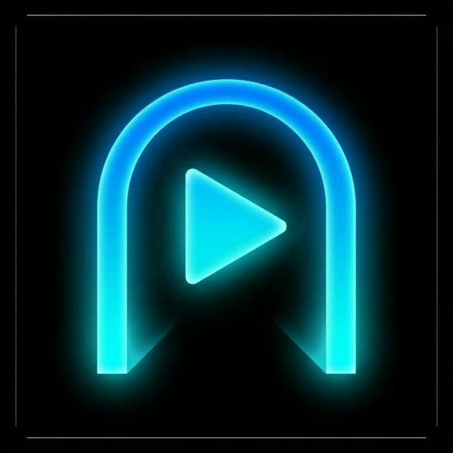

  

<strong>Entryway</strong>

多服务器聚合管理的 Android 媒体客户端，支持 Jellyfin 和 Emby。

A multi-server aggregation Android media client for Jellyfin & Emby.

  
  
  
  
  

---

## 概述 | Overview

**Entryway** 是一个面向自建媒体服务器用户的 Android 客户端，核心设计理念是 **多服务器聚合**——在一个统一的界面中管理和浏览你所有的 Jellyfin / Emby 服务器。

Entryway is an Android client designed for self-hosted media server users. Its core philosophy is **multi-server aggregation** — managing and browsing all your Jellyfin / Emby servers from a single, unified interface.

## 核心特性 | Features

### 🖥️ 多服务器管理
- 添加多个 Jellyfin / Emby 服务器，一键快速切换
- 服务器卡片显示用户头像、用户名、服务器地址
- 长按菜单：重新登录、服务器线路、修改图标、修改备注、设为私密、修改密码、编辑、删除
- 溢出菜单：搜索、排序（默认/名称/最近使用）、网格/列表布局切换、显示选项
- 私密服务器：标记后默认隐藏，需手动开启显示

### 🏠 首页即服务器
- 首页直接展示当前活跃服务器的媒体库内容
- 左上角显示当前服务器名，点击即可切换到其他非私密服务器
- 支持精选轮播（Featured Carousel）和无轮播两种模式

### 🎬 双引擎播放器
- **ExoPlayer 引擎**：默认播放引擎，基于 Media3 + Jellyfin FFmpeg 扩展
- **mpv 引擎**：备用高兼容性引擎，基于 libmpv，支持更多编解码格式
- 播放失败时自动提供引擎切换建议，支持手动一键切换
- 切换引擎时自动保持播放进度
- 统一 User-Agent：`Entryway/{version} (android; {api})`

### ⏩ 播放控制
- **倍速播放**：0.1x ~ 5.0x 滑动条 + 快速预设（0.5x / 1.0x / 1.5x / 2.0x / 3.0x）
- **长按快速倍速**：长按屏幕进入手动短时间高速播放
- **手势控制**：左右滑动快进快退、左侧上下滑动调亮度、右侧上下滑动调音量
- **画面比例**：循环切换适应/填充/16:9/4:3 等比例模式
- **锁屏**：锁定控制界面，防止误触
- **剧集导航**：上一集/下一集，播放列表（仅剧集）

### 🔧 mpv 引擎专属
- **解码模式切换**：SW（软解）/ HW（硬解）/ HW+（硬解+拷贝）一键循环切换
- 字体自动加载，支持字幕渲染

### 🔊 高级音频
- Apple Spatial Audio 空间音频检测与启用
- HDR / Dolby Vision 能力检测与自动适配

### 🎨 全局主题系统
- 支持 **跟随系统** / **浅色** / **深色** 三种主题模式
- 基于 Material 3 动态配色方案

### 🌐 完整国际化
- 界面支持中文（简体/繁体）和英文
- 50+ 影视类型名称客户端翻译
- 根据系统语言自动切换

### 📥 离线下载
- 队列化下载管理，支持暂停/恢复/取消
- 季度/剧集批量下载，下载前显示存储空间预估
- 无网络时自动切换到离线内容模式

## 技术栈 | Tech Stack

| 类别 | 技术 |
|------|------|
| **语言** | Kotlin 2.0, Coroutines, Flow |
| **UI** | Jetpack Compose + Material 3 + Navigation Compose |
| **网络** | Retrofit 3 + OkHttp 5 |
| **图片** | Coil 3 |
| **播放器** | Media3 ExoPlayer + FFmpeg 扩展 / libmpv (双引擎) |
| **存储** | SharedPreferences + DataStore |
| **构建** | Gradle 9.4, AGP, KSP |

## 贡献 | Contributing

欢迎提交 Issue 和 Pull Request。较大的功能开发建议先开 Issue 讨论范围。
